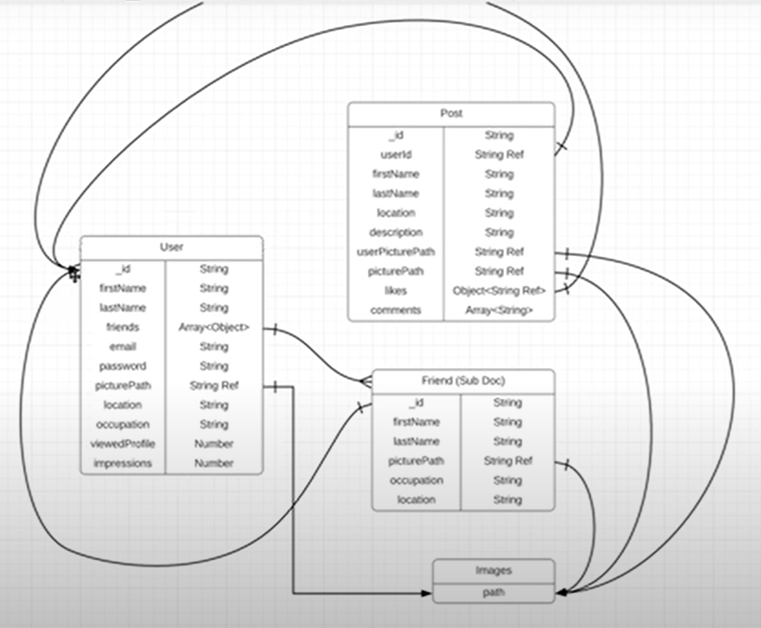

# MERN Social Media Web Application

## SERVER
- Create `server` folder and then `cd server` folder.
- First setup the project by `npm init`
- Install following packages using `npm install`
    - `npm i express mongoose dotenv bcrypt cors gridfs-stream helmet jsonwebtoken morgan multer multer-gridfs-storage`
- change `type: "module"` in package.json file to use import instead of require.
- import all the packages in `index.js`
- Configurations:
    - set middlewares and other configurations
    - set up a file storage configuration.
- Sign up/in mongodb account and deploy a cloud database
- In `.env` file add `MONGO_URL` which is uri given by mongodb. and set port.
- Setup mongoose

**NOTE: MongoDB is a free form compare to SQL type databases. But still it's important to organize your data beforehand. So that you will get good structure and can save a lot of time.**

Data model:  

- Authentication and Authorization
    - Authentication: when you register and log in 
    - Authorization: When user logged in then they can do things that a non-logged in user can’t do. Means they will hit APIs that normal users would not be able to. 
    - Make a post route *'/auth/register'*
    - Make `/controllers/auth.js`
    - Make `/Models/Users.js` to make schema for user. and complete the functionality of *'/auth/register'*.
    - Create `/routes/` folder to keep all routes. and make `auth.js` file in it to set route for login. Because of `express.Router()` we able to set this route in different file to make project clean.
    - Write login functionality in `/controllers/auth.js`
    - For authorization, make folder `/middleware/auth.js`

- Now, set separate route for user routes. Create `routes/users.js`
- Create `controllers/users.js` to write functionality for users such as getUser, getUserFriends, addRemoveFriends.
- Now, make post route of createPost in `index.js` file because it will need 'upload' variable. and other routes in `routes/posts.js`.
- Write functionality for post in `controllers.js/posts.js`. But before writing it make post schema in `models/post.js`.